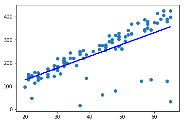
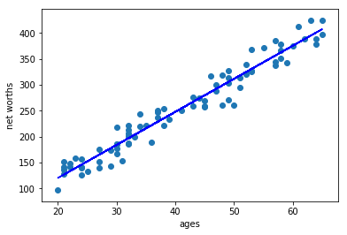

# Outliers and Cleaning data
#
Cleaning data can be an ambiguous task as some outliers may actually be of significance whereas others might be errors. There are 2 types of such outliers:
1. Errors (Maybe due to Sensor malfunction or data entry)
2. Interesting points (An actual outlier in terms of consistency)
#
### Removing outliers
1. Train
2. Remove ~10% of the points based on residual errors
3. Train again
#
This has been demonstrated by the following graphs on the age_net-worth dataset:
- Without data cleaning

#
- After cleaning the data

