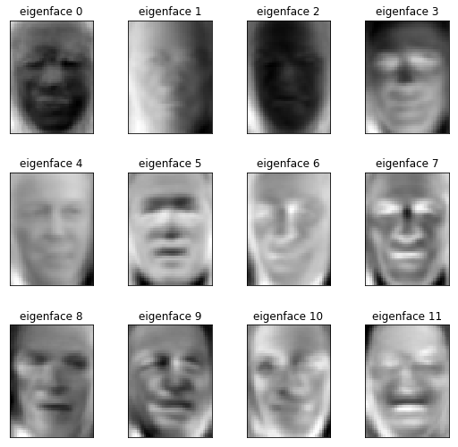

# Dimensionality Reduction using PCA
#
PCA performs eigenvalue decomposition and reduces dimensions whilst preserving information by maximising the varaince of the components
#
### Eigenfaces
Eigenfaces is a facial identification problem wherein the dataset has pictures of US presidents and the model must predict their faces based on the SVM(Support Vector Machine) classifier which receives an input whose dimensions are reduced using PCA (from 1850 to 150).   
Here are the results for a few of them:
