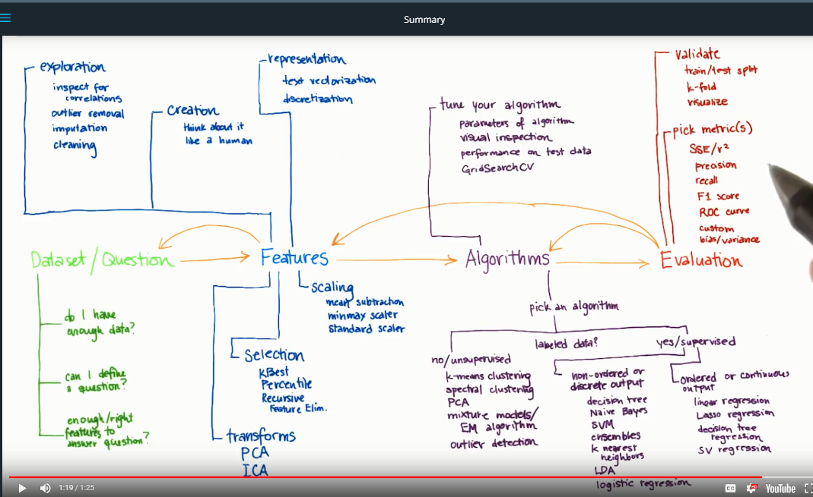

# 100-Days-of-ML-Code
Daily log to track my progress on the 100 days of ML code challenge.

### Day 1 (09-09-18) : Naive Bayes
- Started with the [intro to machine learning](https://in.udacity.com/course/intro-to-machine-learning--ud120-india)  course on Udacity 
- Learnt the basics of a Naive Bayes classifier on the `iris` dataset
- Working on classifying the `Stanley Terrain` dataset and graph the decision surface

### Day 2 (10-09-18) : Naive Bayes mini-project
- Working on the Naive Bayes mini-project to classify email.
- Tried really hard to make the python 2.7 code compatible with 3.6 and learnt about `dos2unix` and pickling of data. 
- Completed the Naive Bayes project with accuracy of 90.24% (Need to improve it!)

### Day 3 (11-09-18) : SVM and Linear Algebra
- Improved efficiency to 97.869% and completed the mini-project.
- Started the lesson on Support Vector Machines.
- Completed Week 1 of Mathematics for [Machine Learning: Linear Algebra](https://www.coursera.org/learn/linear-algebra-machine-learning), a course from Imperial College London on Coursera.

### Day 4 (12-09-18) : SVM and Decision Trees
- Completed the SVM mini-project with 99.08% accuracy using an `rbf` kernel 
- Started the lesson on Decision Trees

### Day 5 (13-09-18) : Decision Trees mini-project
- Working on the Decision tree mini-project
- Referred to 3Blue1Brown's [Essence of Calculus](https://www.youtube.com/channel/UCYO_jab_esuFRV4b17AJtAw) playlist

### Day 6 (14-09-18) Decision Tree(Entropy and Information gain) and KNN 
- Completed the Decision Tree mini-project
- Learnt about the K-Nearest Neighbours classifier and implemented the same

### Day 7 (15-09-18) K-Nearest Neighbours
- Implemented the KNN classisier after referring to [this](https://towardsdatascience.com/implementing-k-nearest-neighbors-with-scikit-learn-9e4858e231ea) Medium article
- Watched 2 more videos from 3Blue1Brown's [Essence of Calculus](https://www.youtube.com/channel/UCYO_jab_esuFRV4b17AJtAw) playlist
- Watched Siraj Raval's [video](https://www.youtube.com/watch?v=T5pRlIbr6gg&index=1&list=PL2-dafEMk2A6QKz1mrk1uIGfHkC1zZ6UU) on classifiers

### Day 8 (16-09-18) RandomForest classifier, Datasets and Questions
- Completed the lesson on datasets and questions to gain key inferences 
- Completed the lesson `WEB 3.0` from Siraj Raval's [Decentralized Applications](https://www.youtube.com/watch?v=aPVmd7SyKfQ) playlist
- Implemented the RandomForest classifier and read up about adaBoost

### Day 9 (17-09-18) Linear Regression, Unsupervised Learning (K Means)
- Completed the lesson on Regressions and implemented the same in the mini-project
- Completed the analysis of outliers in the enron dataset and the Q&A on the analysis
- Completed the lesson on unsupervised learning (K-Means clustering) 
- Implemented K Means clustering on the Enron dataset
- Completed the lesson on feature scaling (MinMaxScaler)

### Day 10 (18-09-18) Bag of words, stemming and TfIdf using NLTK
- Stemming using NLTK(Natural Language Toolkit)
- Completed the lesson on text learning
- Completed implementing the string processing techniques in the dataset (17578 emails)

### Day 11 (19-09-18) Feature Selection, Dimensionality Reduction(PCA) and Validation
- Completed the lesson on feature selection
- Implemented Lasso regression to understand regularization
- Completed the lesson on dimensionality reduction
- Working on the eigenfaces mini-project
- Completed the lesson on Validation and its exercises

### Day 12 (20-09-18) Evaluation metrics and intro to neural networks
- Completed the lesson on evaluation metrics and its exercises
- Started the Deeplearning.ai course [Neural Networks and Deep learning](https://www.coursera.org/learn/neural-networks-deep-learning) by Andrew NG
- Completed the intro to machine learning course on Udacity!!  

### Day 13 (21-09-18) Enron Fraud Detection  
- Working on finding the persons of interest from the Enron emails dataset
- Completed Week 1 of the Neural networks and deep learning course

### Day 14 (22-09-18) Intro to tensorflow and tensorflow.js
- Read up about Tensorflow from the documentation and medium articles
- Watched 2 [Coding Train](https://www.youtube.com/playlist?list=PLRqwX-V7Uu6YIeVA3dNxbR9PYj4wV31oQ) videos to understand Tensorflow.js

### Day 15 (23-09-18) Intro to deep learning
- Implemented classifier and regressor using tensorflow and compared the same with the sklearn implementations
- Learnt about the softmax, one-hot encoding and cross-entropy loss minimization using gradient descent

### Day 16 (24-09-18) Data preprocessing and handling missing data
- Learn best practices to handle missing data and effective feature selection
- Practiced the preprocessing workflow

### Day 17 (25-09-18) Stock Predictor App
- Built a basic stock predictor app that predicts the value of the stock and the value of the company
- Referred to [this](https://www.youtube.com/watch?v=SSu00IRRraY) video by Siraj Raval

### Day 18 (26-09-18) Data Science on the HI-SEAS dataset
- Analyzed the Mars HI-SEAS dataset using SVM (and PCA) to unearth outliers and analyze for predictive analytics
- Performed data wrangling and analysis using dplyr in R

### Day 19 (27-09-18) Intro to deep learning
- Started the [Intro to deep learning](https://classroom.udacity.com/courses/ud730) course by Google Brain's principal scientist Vincent Vanhoucke

### Day 20 (28-09-18) Neural network for notMNIST
- Built a neural network with 84% accuracy for the notMNIST dataset
- Completed lesson 1 of the intro to deep learning course

### Day 21 (29-09-18) Neural Networks and deep learning
- Working on week 2 of Andrew NG's course on deep learning and neural networks
- Implemented gradient descent from scratch

### Day 22 (30-09-18) Neural Networks and Deep Learning
- Completed assignment 1 of week 2 
- Implemented logistic regression using a neural network approach to classify images
- Completed Week 2 of Andrew NG's course

### Day 23 (1-10-18) Implemented gradient descent from scratch
- Implemented gradient descent form scratch
- Learnt more about activation functions sigmoid, tanh, ReLU and leaky ReLU
- Learnt about the advantages and differences between tensorflow.js and tensorflow

### Day 24 (2-10-18) Planar data classification using a neural network
- Completed planar classification assignment
- Completed Week 3 of Andrew NG's Neural Networks course
- Started Week 4 of the course

### Day 25 (3-10-18) Deep neural networks
- Completed all lecture videos of Week 4 pertaining to deep neural networks
- Working on the programming assignments
- Completed assignment 1

### Day 26 (4-10-18) Cat-notCat classifier from scratch
- Working on a cat-notCat binary classifier using a deep neural net
- Completed Week 4 of the course and obtained the [certificate](https://www.coursera.org/account/accomplishments/verify/G7BWGP9QRM27)!

### Day 27 (5-10-18) Hyperparameter tuning and regularization
- Learnt the math behind Frobenius norm and regularization
- Started course 2 of Andrew NG's Deeplearning.ai specialization

### Day 28 (6-10-18) Optimization and regularization
- Completed week 1 materials and working on the optimization exercises
- Implemented l2-regularization from scratch
- Implemented dropout (forward and back-prop) from scratch
- Implemented Gradient checking from scratch
- Completed Week 1 of the course

### Day 29 (7-10-18) mini-batch gradient descent with momentum and Adam
- Implemented mini-batch gradient descent with momentum
- Implemented Adam optimization from the ICLR 2015 paper
- Completed week 2 of the course

### Day 30 (8-10-18) Batch normalization, softmax and Structuring ML Projects!
- Implemented batch normalization from scratch
- Working on the SIGNS dataset to identify numbers from sign language (Using Tensorflow)
- Completed the course on Improving deep neural nets - [certificate](https://www.coursera.org/account/accomplishments/verify/YN49PTQCJ3TV)

### Day 31 (9-10-18) Structuring ML Projects and transfer learning
- Completed the course on structuring machine learning projects! [Certificate](https://www.coursera.org/account/accomplishments/verify/BWWB38P66T7N)
- Learnt more about transfer learning

### Day 32 (10-09-18) Familiarizing myself with Tensorflow
- Read and practiced from the Tensorflow documentation to better understand the workflow
- Understood the importance of GPUs in Deep Learning and the `tensorflow-gpu`module

### Day 33 (11-10-18) Edge detection and convolutions
- Started Week 1 of Andrew NG's course on Convolutional Neural Networks
- Learnt more about Tensorflow from Jordi Torres' Deep Learning book

### Day 34 (12-10-18) Building a Convolutional layer and Pooling
- Completed Week 1 of Convolutional Neural Networks
- Learnt about pooling(POOL) and fully connected(FC)

### Day 35 (13-10-18) GDG DevFest 2018 and CNN step by step
- Attended GDG DevFest 2018! Was a very informative event for ML/AI practitioners
- Working on building a CNN step by step

### Day 36 (14-10-18) What is AlphaGoZero and intro to RL
- Learnt more about Google's ALphaGoZero and why it's such a big breakthrough
- Learnt the very basics of Reinforcement Learning

### Day 37 (15-10-18) Basics of Reinforcement Learning
- Learnt about Basics of RL from David Silver's online course

### Day 38 (16-10-18) CNNs
- Learnt about Pooling layers for CNNs and improved implementation
- Working on Week 2 content of Andrew NG's CNNs course

### Day 39 (17-10-18) Landing a rocket using Reinforcement Learning
- Learning about PPOs (Proximal Policy Optimization) in RL
- Learning about rocket launches to build an app to track space-flight schedules
- Building and training a ConvNet in TensorFlow for a classification problem

### Day 40 (18-10-18) Nasa SpaceApps Preparartion
- Spent some time preparing data from Nasa datasets for the topic "Do YOU Know When the Next Rocket Launch Is?"

### Day 41 (19-10-18) Data preparation and pre-processing 
- Prepared and pre-processed the data for the Nasa SapceApps competition

### Day 42 (20-10-18) Nasa SpaceApps Challenge Nationals
- Using the GLOBE dataset to predict effective sunlight cover on solar panels 

### Day 43 (21-10-18) Worked on CNNs and Monte Carlo Simulations
- Used Monte Carlo simulations and normalization to predict the conversion factor for solar panels
- Used the conversion factor thus obtained to build a calculator to visualize the data
- Worked on CNNs with a 'selu' activation function for better learning rate with normalization

### Day 44 (22-10-18) Revised CNNs from Andrew NG's course notes
- Revised building CNNs from scratch from Andrew NG's course notes

### Day 45 (23-10-18) Artificial Intelligence
- Studying for internal exam on the subject of Artificial Intelligence

### Day 46 (24-10-18) Artificial Intelligence
- Studied for my AI exam on 25th
- This includes pedicate logic, Bayesian statistics, Bayesian networks and partitioned semantic nets

### Day 47 (25-10-18) AI exam and CNNs for roof exposure estimation
- Gave my AI exam and probably aced it!
- Working on training a model on a scraped data of roof pictures with given dimensions (labelled) into a CNN to estimate the solar irradiance incident on the surface

### Day 48 (26-10-18) Car detection using YOLOv2
- Working on a You Only Learn Once model for car detection
- The ML project pipeline is underway
- Went to the Google office for a meetup called #chAI where early stage AI startups explailned the deep learning they have been doing
- fixed all deployment bugs in the Nasa SpaceApps project and hosted the website

### Day 49 (27-10-18) Learnt more about YOLO
- Learnt more about YOLOv2 from medium articles
- Got project guidance and tips on the Solar roof CNNs project from Vibhor Kalra from merak.ai
- He suggested to look into tensorflow.js if browser based real-time models need to be deployed
- Need to learn about deploying a tensorflow project
- Learnt about tf-lite models and their merits and demerits for DL apps

### Day 50 (28-10-18) Monte Carlo simulations and curve fitting in R
- Improved the prediction model for the solar project and working on the final submission as today is the last day
- Registered for the Microsoft AI challenge to improve Bing's suggestion box answers using DL models
- Re-doing the plan for the next 50 days to get the most done from this challenge

### Day 51 (29-10-18) Sentiment classification
- An implementation from Andrew Trask's [blog](http://iamtrask.github.io/) about sentiment classification to frame problems in deep learning
- Completed CNN implementation from scratch
- Still working on a feedback analysis of the progress thus far to get much more done in the second half of the challenge

### Day 52 (30-10-18) Improving CNN Backpropagation
- Studying the math behind backpropagation (for CNNs) from Ian Goodfellow's Deep Learning Textbook

### Day 53 (31-10-18) Fully functioning ConvNets using Tensorflow
- Implemented a fully functional CNN using Tensorflow
- Improved the friend dashboard project 
- ALso created a Genomic and AI related github organization for related projects

### Day 54 (1-11-18) GenomicAI's website and revising data science in R from Rafael's Textbook
- Working on GenomicAI's website. Looking to finish it up after Monday's exam
- Revising data science in R from Harvard Prof Rafael's textbook

### Day 55 (2-11-18) GCP's How Google does ML 
- Completed half the course by Google Cloud Platform on 'How Google does ML'
- Working on the paper on 'Genomic analysis for persoanlized medicine'

### Day 56 (3-11-18) GCP Datalab for ML intances
- Earthquakes project using a datalab instance [Link](https://storage.googleapis.com/usgs-ingest-transform/earthquakes/earthquakes.htm)
- [Project Link](https://github.com/Vishal-V/GCP-Datalab-ML)
.png)
- The Common pitfalls in ML deployment. Gosh it has much more to do with stuff other than ML!